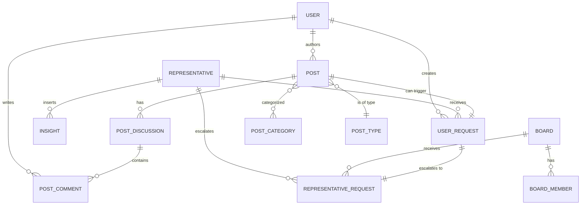

# MindsUnited - Database Schema Documentation

[YouTube Demo](https://www.youtube.com/watch?v=v6z7UJE8i2I)

## Overview

MindsUnited is a collaborative platform built as part of Sustainable Development Goals with focus on fostering international problem solving, knowledge sharing, and innovation. The system implementes hierarchical model of boards, board members, representatives, and users. User publish their ideas, solutions to problems in categories of SDG, discuss with others, browse current problems, etc. To facilitate a solution deployment for a real-world problem, the system implements a hierarchical request workflow where users submit their solutions for approval to representatives who then escalate them to boards for review.

Furthermore, the system acts as a registry of solutions and insights. In particular, the insights part, not implemented in this version, aims to integrate AI which analyzes users' posts and creates insights for later use.

## Architecture Pattern

- **ORM**: SQLAlchemy with Flask-SQLAlchemy
- **Inheritance**: Joined Table Inheritance (JTI) for User hierarchy
- **Relationships**: Self-referential and many-to-many associations via junction tables
- **ID Strategy**: Auto-incrementing primary keys + UUID alternative IDs for public exposure

---

## Core Entities

### User Hierarchy

The system implements polymorphic user types using [SQLAlchemy's joined table inheritance](https://docs.sqlalchemy.org/en/20/orm/inheritance.html#joined-table-inheritance).

#### `user_table` (Base)
**Purpose**: Core user entity with shared attributes

| Column | Type | Constraints | Description |
|--------|------|-------------|-------------|
| `id` | INTEGER | PK | Internal identifier |
| `alternative_id` | VARCHAR | Unique | UUID for public URLs |
| `full_name` | VARCHAR(40) | NOT NULL | User's full name |
| `username` | VARCHAR(20) | UK | Unique username |
| `email` | VARCHAR(50) | UK | Unique email |
| `profession` | VARCHAR(30) | | User's profession |
| `age` | INTEGER | Nullable | User's age |
| `password_hash` | VARCHAR | NOT NULL | Hashed password |
| `registered_at` | DATETIME | Default: UTC now | Registration timestamp |
| `type` | VARCHAR | NOT NULL | Discriminator for polymorphism |

**Relationships**:
- `authored_posts` → Post (1:N)
- `contributed_posts` → Post (M:N via `post_contributed_authors_table`)
- `post_comments` → PostComment (1:N)
- `requests` → UserRequest (1:N as caller)

**Polymorphic Types**: `user`, `board_member`, `representative`

#### `board_member_table` (Inherited)
**Purpose**: Users with board membership privileges

| Column | Type | Constraints | Description |
|--------|------|-------------|-------------|
| `id` | INTEGER | PK, FK(user_table.id) | Inherited user ID |
| `board_id` | INTEGER | FK(board_table.id) | Assigned board |

**Additional Relationships**:
- `board` → Board (N:1)
- `board_comments` → BoardDiscussionComment (1:N)

#### `representative_table` (Inherited)
**Purpose**: Users authorized to handle escalations to boards

| Column | Type | Constraints | Description |
|--------|------|-------------|-------------|
| `id` | INTEGER | PK, FK(user_table.id) | Inherited user ID |

**Additional Relationships**:
- `incoming_requests` → UserRequest (1:N as receiver)
- `repr_requests` → RepresentativeRequest (1:N as sender)
- `inserted_insights` → Insight (1:N)

---

### Board System

#### `board_table`
**Purpose**: Organizational boards for decision-making

| Column | Type | Constraints | Description |
|--------|------|-------------|-------------|
| `id` | INTEGE   R | PK | Board identifier |
| `established_at` | DATETIME | Default: UTC now | Creation timestamp |

**Relationships**:
- `members` → BoardMember (1:N)
- `incoming_requests` → RepresentativeRequest (1:N)

---

## Content Management

### Post System

#### `post_table`
**Purpose**: User-generated content (issues, solutions, ideas)

| Column | Type | Constraints | Description |
|--------|------|-------------|-------------|
| `id` | INTEGER | PK | Post identifier |
| `alternative_id` | VARCHAR | Unique | UUID for public URLs |
| `title` | VARCHAR(100) | NOT NULL | Post title |
| `body` | TEXT | NOT NULL | Post content |
| `upvotes` | INTEGER | Default: 0 | Community votes |
| `private` | BOOLEAN | Default: FALSE | Visibility flag |
| `created_at` | DATETIME | Default: UTC now | Creation timestamp |
| `updated_at` | DATETIME | Default: UTC now | Last modification |
| `confirmed_for_deployment` | BOOLEAN | Default: FALSE | Deployment approval |
| `confirmed_for_insights` | BOOLEAN | Default: FALSE | Insights approval |
| `original_author_id` | INTEGER | FK(user_table.id) | Primary author |
| `post_type_id` | INTEGER | FK(post_type_table.id) | Content classification |
| `outgoing_requet_id` | INTEGER | FK(user_request_table.id), Nullable | Associated request |

**Relationships**:
- `original_author` → User (N:1)
- `contributing_authors` → User (M:N via `post_contributed_authors_table`)
- `post_type` → PostType (N:1)
- `post_categories` → PostCategory (M:N via `post_category_association_table`)
- `post_discussion` → PostDiscussion (1:1)
- `linked_posts` / `linked_to` → Post (M:N self-referential via `post_to_post_association_table`)
- `insights` → Insight (1:N)
- `outgoing_request` → UserRequest (1:1)

#### `post_type_table`
**Purpose**: Categorize posts by type

| Column | Type | Constraints | Description |
|--------|------|-------------|-------------|
| `id` | INTEGER | PK | Type identifier |
| `name` | VARCHAR(20) | NOT NULL | Type name |

**Examples**: Issues, Solutions, Ideas, Issue Relations, Solution Relations

#### `post_category_table`
**Purpose**: Tag posts with topics (e.g., SDG alignment)

| Column | Type | Constraints | Description |
|--------|------|-------------|-------------|
| `id` | INTEGER | PK | Category identifier |
| `name` | VARCHAR(20) | NOT NULL | Category name |

**Examples**: Climate, Education, Health, Economy

---

### Discussion System

#### `discussion_table` (PostDiscussion, inherits from abstract Discussion class)
**Purpose**: Discussion for each post

| Column | Type | Constraints | Description |
|--------|------|-------------|-------------|
| `id` | INTEGER | PK | Discussion identifier |
| `post_id` | INTEGER | FK(post_table.id) | Associated post |
| `created_at` | DATETIME | Default: UTC now | Creation timestamp |

**Relationships**:
- `post` → Post (1:1)
- `post_comments` → PostComment (1:N)

#### `board_discussion_table`
**Purpose**: Discussion threads in boards

| Column | Type | Constraints | Description |
|--------|------|-------------|-------------|
| `id` | INTEGER | PK | Discussion identifier |
| `topic` | TEXT | NOT NULL | Discussion topic |
| `created_at` | DATETIME | Default: UTC now | Creation timestamp |

**Relationships**:
- `board_discussion_comments` → BoardDiscussionComment (1:N)

## Commenting

#### `Comment` abstract class
**Purpose**: Serve as parent class for inheritance specialized comment models. Uses `@declared_attr` for dynamically providing fields for inheriting models.

#### `post_comment`
**Purpose**: Comments on post discussions

| Column | Type | Constraints | Description |
|--------|------|-------------|-------------|
| `id` | INTEGER | PK | Comment identifier |
| `author_id` | INTEGER | FK(user_table.id) | Comment author |
| `post_discussion_id` | INTEGER | FK(discussion_table.id) | Parent discussion |
| `text` | TEXT | NOT NULL | Comment content |
| `upvotes` | INTEGER | Default: 0 | Community votes |

#### `board_discussion_comment`
**Purpose**: Comments on board discussions

| Column | Type | Constraints | Description |
|--------|------|-------------|-------------|
| `id` | INTEGER | PK | Comment identifier |
| `author_id` | INTEGER | FK(user_table.id) | Comment author (BoardMember) |
| `board_discussion_id` | INTEGER | FK(board_discussion_table.id) | Parent discussion |
| `text` | TEXT | NOT NULL | Comment content |
| `upvotes` | INTEGER | Default: 0 | Community votes |

---

## Request Workflow System

### Two-Tier Request Architecture

The system implements a hierarchical approval workflow:
1. **User → Representative** (UserRequest)
2. **Representative → Board** (RepresentativeRequest)

#### `user_request_table`
**Purpose**: User requests for representatives

| Column | Type | Constraints | Description |
|--------|------|-------------|-------------|
| `id` | INTEGER | PK | Request identifier |
| `calling_user_id` | INTEGER | FK(user_table.id) | Requesting user |
| `receiving_representative_id` | INTEGER | FK(representative_table.id) | Assigned representative |
| `confirmed` | BOOLEAN | Default: FALSE | Approval status |
| `created_at` | DATETIME | Default: UTC now | Request timestamp |
| `closed_at` | DATETIME | Nullable | Closure timestamp |

**Relationships**:
- `calling_user` → User (N:1)
- `receiving_representative` → Representative (N:1)
- `request_object` → Post (1:1)
- `linked_repr_request` → RepresentativeRequest (1:1)

**Load Balancing**: A representative with minimum current load is auto-assigned.

#### `representative_request`
**Purpose**: Representative escalations (requests) to a board

| Column | Type | Constraints | Description |
|--------|------|-------------|-------------|
| `id` | INTEGER | PK | Request identifier |
| `calling_user_request_id` | INTEGER | FK(user_request_table.id) | Source user request |
| `representative_id` | INTEGER | FK(representative_table.id) | Escalating representative |
| `board_id` | INTEGER | FK(board_table.id) | Target board |
| `confirmed` | BOOLEAN | Default: FALSE | Board approval status |
| `created_at` | DATETIME | Default: UTC now | Escalation timestamp |
| `closed_at` | DATETIME | Nullable | Closure timestamp |

**Constraints**:
- Unique constraint on `(calling_user_request_id, representative_id)` to avoid duplication

**Load Balancing**: A board with minimum current load is auto-assigned.

---

## AI Integration (not implemented)

#### `insights_table`
**Purpose**: AI-processed content insights

| Column | Type | Constraints | Description |
|--------|------|-------------|-------------|
| `id` | INTEGER | PK | Insight identifier |
| `inserting_representative_id` | INTEGER | FK(representative_table.id) | Creating representative |
| `source_post_id` | INTEGER | FK(post_table.id) | Source post |
| `ai_tuned_text` | TEXT | NOT NULL | Processed content |
| `created_at` | DATETIME | Default: UTC now | Creation timestamp |

**Access Control**: Only representatives can insert insights.

---

## Junction Tables

### `post_user_association_table`
**Purpose**: Generic user-post associations (future use, not needed now)

| Column | Type | Constraints |
|--------|------|-------------|
| `user_id` | INTEGER | FK(user_table.id), Nullable |
| `post_id` | INTEGER | FK(post_table.id), Nullable |

### `post_contributed_authors_table`
**Purpose**: Track collaborative authorship

| Column | Type | Constraints |
|--------|------|-------------|
| `user_id` | INTEGER | FK(user_table.id), Nullable |
| `post_id` | INTEGER | FK(post_table.id), Nullable |

### `post_category_association_table`
**Purpose**: Many-to-many post categorization

| Column | Type | Constraints |
|--------|------|-------------|
| `post_category_id` | INTEGER | FK(post_category_table.id), Nullable |
| `post_id` | INTEGER | FK(post_table.id), Nullable |

### `post_to_post_association_table`
**Purpose**: Self-referential post relationships

| Column | Type | Constraints |
|--------|------|-------------|
| `post_id` | INTEGER | FK(post_table.id), Nullable |
| `linked_post_id` | INTEGER | FK(post_table.id), Nullable |

**Use Cases**: Link solutions to issues, relate similar ideas

---

## Key Design Patterns

### 1. **UUID Public IDs**
- Internal integer PKs for performance
- UUIDs (`alternative_id`) in URLs for safety

### 2. **Polymorphic User Types**
- Joined Table Inheritance with `type` discriminator
- Enables shared authentication/authorization logic
- Reduces code duplication

### 3. **Request Workflow**
```
User → UserRequest → Representative → RepresentativeRequest → Board
```
- Load-balanced assignment at each tier
- Status tracking via `confirmed` and `closed_at`
- **Logic**:
    - If representative approves a UserRequest, it only creates RepresentativeRequest
    - A post can be `confirmed` only when RepresentativeRequest gets approval from a board

### 4. **Soft Ownership**
- `original_author` = primary creator
- `contributing_authors` = collaborators
- Enables collaborative content development

### 5. **Approval Gates**
- `confirmed_for_deployment`: Ready for production
- `confirmed_for_insights`: Approved for AI processing
- Enables thorough review before deployment and AI processing

---

## Security Considerations

1. **Password Hashing**: Werkzeug's `generate_password_hash`
2. **UUID Exposure**: Alternative IDs in public URLs
3. **Privacy Controls**: `private` flag on posts
4. **Access Control**: Type-based permissions (representatives, board members)

---

## Scalability Notes

1. **Load Balancing**: Auto-assignment prevents representative/board overload
2. **Indexes Needed**
3. **Pagination Needed**

---

## ERD Summary



**Version**: 1.0  
**Last Updated**: 2025-10-01  
**Database**: SQLite (development)
